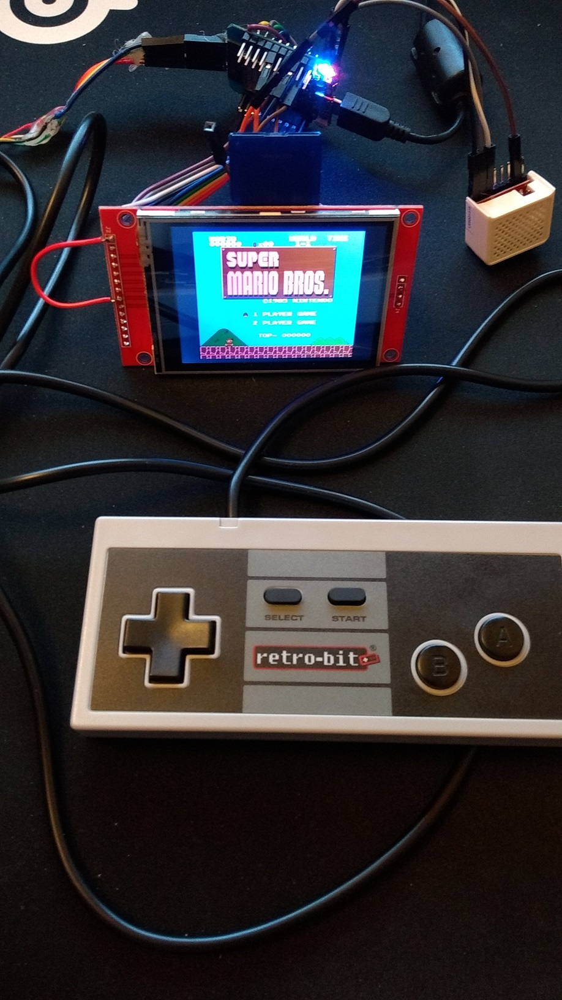
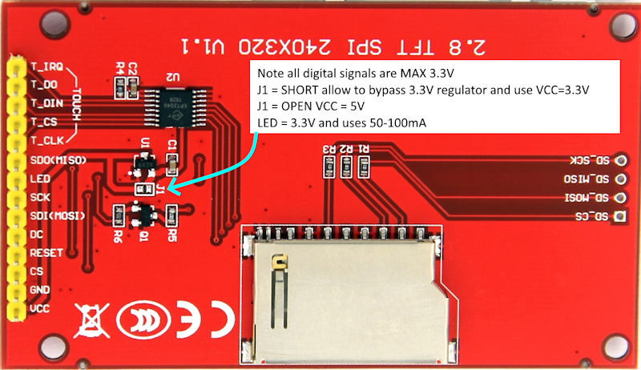

# **NESEMU:** emulates the NES game console on an ESP32 with a 320x240 ILI9341 TFT screen, audio output, various controller inputs and SD card
## Supports classic NES/SNES/PSX controllers or raw GPIO buttons.


**NESEMU** Compiles with Arduino IDE framework and flash/upload the binary to an ESP32 (above WEMOS D1 mini).


**ILI9143** Info about the LCD.

```
     ---------
    |      25 |--------> audio out
    |         |  gnd <-> gnd
    |         |
    |      5  |--------> LCD ILI9341 CS
    |      0  |--------> LCD ILI9341 RESET
    |      2  |--------> LCD ILI9341 DC
    |      23 |--------> LCD ILI9341 MOSI
    |      18 |--------> LCD ILI9341 SCLK
    |      19 |--------> LCD ILI9341 MISO
    |         |  3v3 <-> LCD ILI9341 LED
    |  ESP32  |  3v3 <-> LCD ILI9341 VCC
    |         |  gnd <-> LCD ILI9341 GND
    |         |
    |      15 |--------> SD card CS
    |      13 |--------> SD card MOSI
    |      14 |--------> SD card SCLK
    |      12 |--------> SD card MISO
    |         |  3v3 <-> SD card VCC
    |         |  gnd <-> SD card GND
    |         |
    |      4  |--------> PSX controller CMD
    |      21 |--------> NES/SNES/PSX controller DATA/DAT
    |      22 |--------> NES/SNES/PSX controller CLOCK
    |      27 |--------> NES/SNES/PSX controller LATCH/ATT
    |         |  3v3 <-> NES/SNES/PSX controller VCC/3V3
    |         |  gnd <-> NES/SNES/PSX controller GND
     ---------

NES        ___
    DATA  |o o| NC
    LATCH |o o| NC
    CLOCK |o o/ 3V3
    GND   |o_/

SNES       _
    3V3   |o|
    CLOCK |o|
    LATCH |o|
    DATA  |o|
          |-|
    NC    |o|
    NC    |o|
    GND   |o|
           -  	
PSX ___________________
    \o o o|o o o|o o o/
     -----------------
     1 2 3 4 5 6 7 8 9
		 
    1->DATA, 2->CMD, 4->GND, 5->3V3, 6->ATT, 7->CLOCK, 9->ACK
```

## Build
The emulator is based on the nofrendo emulator (by Matthew Conte) which was ported to the ESP32 esp-idf framework by SpriteTM. Later versions from different people added various extras to the build. This version uses the code from various sources originating amoung others from "MittisBootloop" version and the build was then transfered to the Arduino IDE framework as a friendlier development platform.
Note that this is still work in progress and not all features has been fully tested. Lot of effort went into getting the emulator to shift data fast through the SPI interface to the LCD to make it run as fast as possible (80MHz clock). The CPU (in a separate task) is just as fast as transfering data with DMA and has lower latency.
There is options to stretch the screen along the X-axis to fill all 256->320 pixels, both interlace and progressive supports bilinear upscaling. Due to the larger amount of data streching will take longer to transfer to the LCD but for interlaced mode and SPI running at 80MHz it is still a viable option with 60fps refresh rate while progressive mode can potentially struggle. Pressing select and left simultaneously will bring up the in game menu while pressing select and start will do a reset. To get back to the ROM menu you'll need hit the reset button on your ESP32 module or power cycle.

## Options
The file config.h in the top directory contains a few options and settings as well as the ESP32 pin mapping. Note that the LCD needs to use the VSPI interface to work fast/properly, additionally there is an option to rotate the screen 180 deg.
The screen is up scaled (256->320 pixels) with either crude nearest sample or bilinear (the x axis up scaling can be turned on and off in the in game menu select + left). Due to some coding tricks bilinaer is just as fast as the more crude nearest sample but bilinear looks much better. Y axis is not scaled at all.
The default way to update the screen is in interlaced mode (odd/even lines as opposed to progressive, full screen update) using the CPU/SPI buffer. This will allow the refreshrate to hit 60FPS even with the screen stretched along the x-axis.
There are options to use DMA but in its current form there is no speed benefit over the CPU. ROMs can be put on the SD card (formatted as FAT) with 8.3 file names and then mapped to the file menu with the "roms.txt" file that also needs to be in the root dir of the SD card.
Note that the selected ROM gets memory mapped in the internal EEPROM of the ESP32 which means some wearing on its finite amount of write cycles (10K-100k writes?). If the same ROM is selected after reset or power on then
only a verify (no write) will take place to make sure the data is intact on the ESP32.

## Hack
Real NES hardware can only display 8 (out of 64) sprites on a scanline. Usually games cycle the sprites to avoid them to be invisible but this has the drawback of making them flicker. I added a hack to allow the emulator to render potentially all 64 sprites on a scanline and avoid the flicker/invisible issue in the config.h file.
Most games will have no problem with this but if prefered return it to 8 to make it run like real NES hardware.

## Controllers
The code base supports different types of controllers but only one at the time. Supported ones are NES, SNES, PSX or raw GPIO buttons (last two are not tested by me).
Select the one you want in the config.h file

## Compiling
Use the Arduino IDE framework to compile and upload to the ESP32 (tested with V1.8.13 with ESP lib V1.04)

## Copyright
Bit of a mixed bag here... Code in this repository is Copyright (C) 2016 Espressif Systems, licensed under the Apache License 2.0 as described in the file LICENSE and components of nofrendo
is Copyright (c) 1998-2000 Matthew Conte (matt@conte.com) and licensed under the GPLv2. Any changes in this repository are otherwise presented to you copyright myself and lisensed under the
same Apache 2.0 license as the Espressif Systems repository.

Enjoy,
Corn