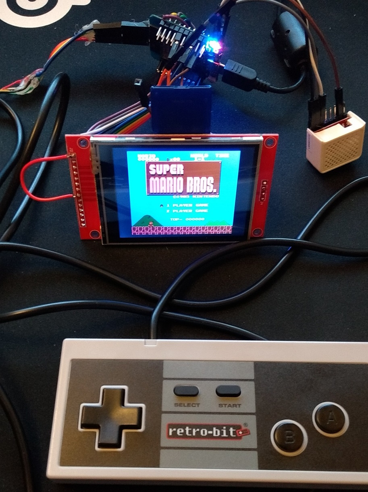

# **NESEMU:** emulates the NES game console on an ESP32 with 320x240 a LCD screen, audio output, controller input and SD card support
## Supports classic NES/SNES/PSX controllers or raw GPIO buttons.



**NESEMU** uses the Arduino IDE framework to compile and flash/upload the binary to an ESP32 module (wemosmini).

```
    -----------
    |      25 |--------> audio out
    |         |  gnd <-> gnd
    |         |
    |      5  |--------> LCD ILI9341 CS
    |      0  |--------> LCD ILI9341 RESET
    |      2  |--------> LCD ILI9341 DC
    |      23 |--------> LCD ILI9341 MOSI
    |      18 |--------> LCD ILI9341 SCLK
    |      19 |--------> LCD ILI9341 MISO
    |         |  3v3 <-> LCD ILI9341 LED
    |  ESP32  |  3v3 <-> LCD ILI9341 VCC
    |         |  gnd <-> LCD ILI9341 GND
    |         |
    |      15 |--------> SD card CS
    |      13 |--------> SD card MOSI
    |      14 |--------> SD card SCLK
    |      12 |--------> SD card MISO
    |         |  3v3 <-> SD card VCC
    |         |  gnd <-> SD card GND
    |         |
    |      21 |--------> NES/SNES controller DATA
    |      22 |--------> NES/SNES controller CLOCK
    |      27 |--------> NES/SNES controller LATCH
    |         |  3v3 <-> NES/SNES controller VCC
    |         |  gnd <-> NES/SNES controller GND
    -----------

NES        ___
    DATA  |o o| NC
    LATCH |o o| NC
    CLOCK |o o/ 3V3
    GND   |o_/

SNES       _
    3V3   |o|
    CLOCK |o|
    LATCH |o|
    DATA  |o|
          |-|
    NC    |o|
    NC    |o|
    GND   |o|
           -  	
	
```

## Build
The emulator is based on the nofrendo emulator (by Matthew Conte) which was ported to the ESP32 esp-idf framework by SpriteTM. Later versions from different people added various extras to the build.
This version uses the code from various sources originating amoung others from "MittisBootloop" version and the build was then transfered to the Arduino IDE framework as a friendlier development platform.
Note that this is still work in progress and not all features has been fully tested. Lot of work went into getting the emulator to shift data fast enought through the SPI interface
to the LCD to make it run @60FPS (non stretched format). Currently the CPU is the fastest way for transfering data but DMA if properly done could boost this further.
There is options to stretch the screen along the X-axis but it has two drawbacks, if the game is of scrolling type then the crude upsampling will make some flickering and due to the larger amount
of data it will take longer to transfer to the LCD. Pressing select and left simultaneously will bring up the in game menu while pressing select and start will do a reset. To get back to the ROM menu
you'll need hit the reset button on your ESP32 module or power cycle the ESP32.

## Options
The file config.h in the src directory contains a few options and settings as well as the ESP32 pin mapping. Note that the LCD needs to use the VSPI interface to work properly, additinally it has a setting to rotate 180.
ROMs can be put on the SD card (formatted as FAT) with 8.3 file names and then mapped to the file menu with the "roms.txt" file that also needs to be in the root dir of teh SD card.
Note that the selected ROM gets memory mapped in the internal EEPROM of the ESP32 which means some wearing on its finite amount of write cycles (100k?). If the same ROM is selected then
only a verify will take place to make sure the data is intact which then will avoid a rewrite of the ROM image to the EEPROM.

## Copyright
Code in this repository is Copyright (C) 2016 Espressif Systems, licensed under the Apache License 2.0 as described in the file LICENSE and components of nofrendo
is Copyright (c) 1998-2000 Matthew Conte (matt@conte.com) and licensed under the GPLv2.

Enjoy,
Corn